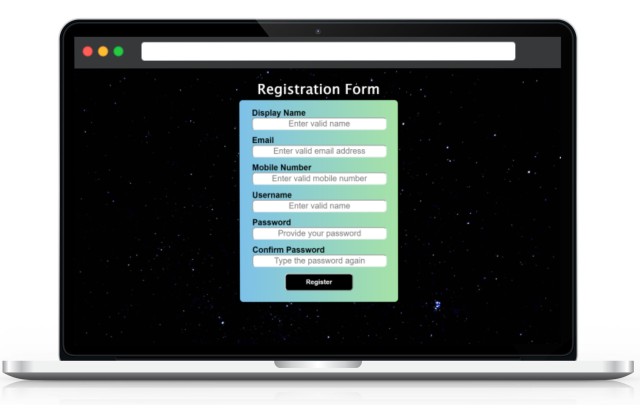
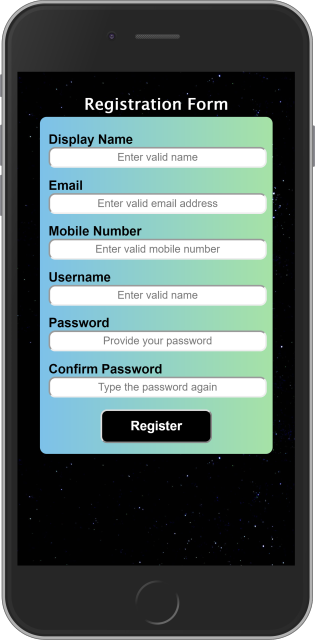

# Registration Form - DevTask 1
A simple registration form with only javascript validation

This task is the first of the #DevTask project hosted by saucecode. It is a simple form with validation being done by Javascript alone. All forms of HTML5 in-built validation was bypassed and the site is fully responsive on mobile views as well.

## Screenshots

## Live Demo

[Hosted Link](https://agitated-mcclintock-582995.netlify.app/)

## Author

Longe Temitope
- Github: [@tamsay](https://github.com/tamsay)
- Twitter: [@longetope](https://twitter.com/longetope)

## 🤝 Contributing

Contributions, issues and feature requests are welcome!

Feel free to check the [issues page](https://github.com/tamsay/regForm/issues)

## Show your support

Give a ⭐️ if you like this project!

## Acknowledgments

Project inspired by @hacksultan for [saucecode.xyz](https://saucecode.xyz/)
